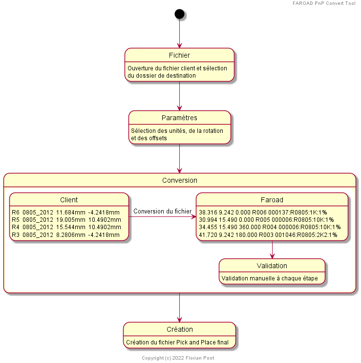
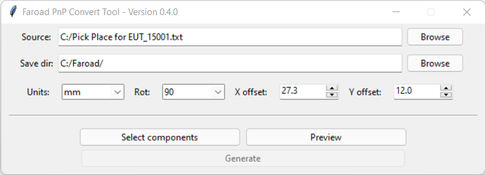
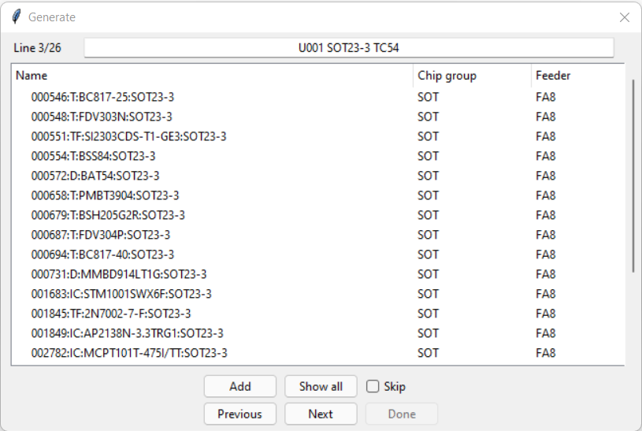
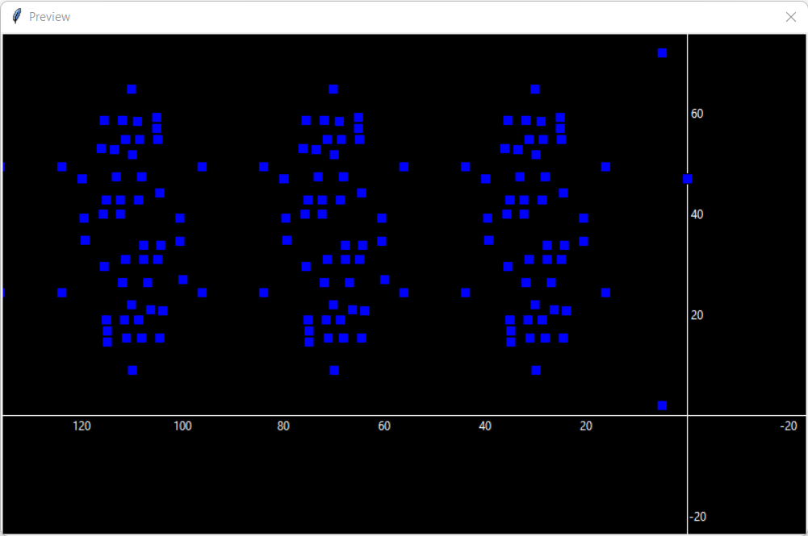

# FAROAD PnP Convert Tool

Faroad PnP Convert Tool est un logiciel qui permet de générer un fichier Pick and 
Place compatible avec la machine Faroad CPM-II à partir d'un fichier client.

Ce logiciel a été conçu pour la société Cepya Electronics.

## Fonctionnalités
* Changement du système de coordonnées pour avoir l'origine à droite.
* Sélection des unités de mesure (mm, inch, mil).
* Rotation des composants du PCB.
* Offsets des positions en X et Y.
* Ajout de zéros de rembourage sur les descriptors (exemple: R1 &#8594; R001).
* Prévisualisation du placage des composants.
* Validation manuelle des composants trouvés.

## Prochainement
* Création automatique du projet avec les emplacements des feeders pré-établis

## Schéma

## Images

